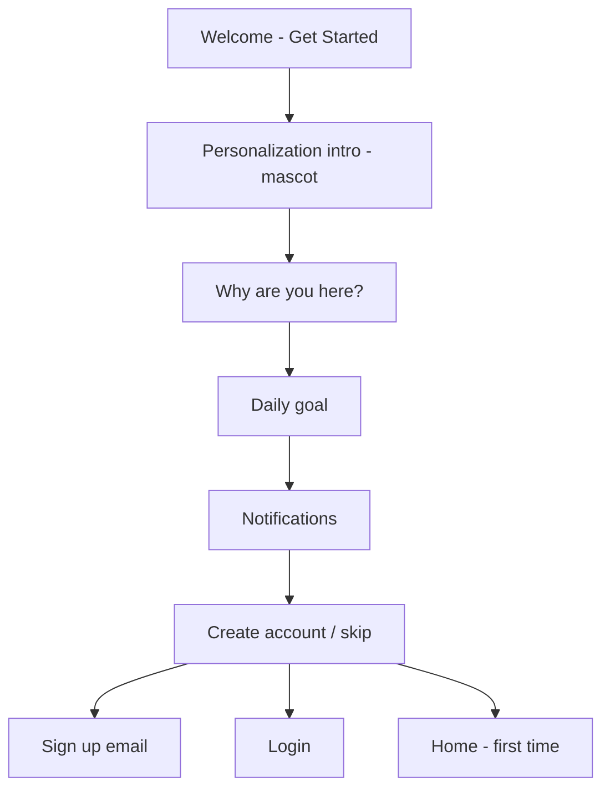

# Onboarding Flow — Duolingo-style (UstadApp Theme)

Reference: Duolingo onboarding pattern (question → mascot intro → daily goal → notifications → account).  
**Your brand:** primary `#05966A`, accent `#E9C468`, dark `#0F1B2A`, ash `#F5F7FA` — see [DESIGN_SYSTEM.md](DESIGN_SYSTEM.md).

**Your copy:** paste final strings in [ONBOARDING_COPY.md](ONBOARDING_COPY.md).

---

## Full flow (after Welcome)



Skip Duolingo’s **duplicate** mascot screen (their screen 6) — you already have **S03**.

---

## Shared chrome (all O01–O04)

| Element | Duolingo | UstadApp |
|---------|----------|----------|
| Progress bar | Yellow thin top | `#E9C468`, height 4px, width = step/total |
| Back | Top-left chevron | Same; `router.back()` |
| Background | White | `#FFFFFF` |
| Title | Bold black ~24px | Nunito **900**, `#0F1B2A` |
| Body | Regular grey | Nunito 600, `#5A5D68` |
| Primary CTA | Green/blue full width | `#05966A` bg, white text, radius 14, height 52 |
| Disabled CTA | Light grey | `#E5E7EB` bg, `#95A3B8` text |
| Secondary link | Grey uppercase | Nunito 700, `#95A3B8`, “Not now” |

**Progress steps:** 4 steps (O01→O04). S03 has **no** progress bar (intro only).

---

## O01 — Motivation (“Why are you learning?”)

**Duolingo pattern:** Single-select list with icon + label; Continue disabled until selection.

| Property | Spec |
|----------|------|
| Route | `app/onboarding/motivation.tsx` |
| Progress | 1 / 4 |
| Layout | Title top → scrollable list → fixed bottom button |

**Option row component**

| State | Style |
|-------|--------|
| Default | White bg, 1px `#E5E7EB` border, radius 12, padding 16, icon left + label |
| Selected | Border `#05966A` 2px OR bg `#F5F7FA` + label `#05966A` |
| Icon | 24px emoji or Feather icon in `#05966A` |

**Behavior**

- Tap row → set `selectedMotivationId`
- Enable Continue when `selectedMotivationId != null`
- Save to `OnboardingAnswers.motivation` (local)

**Suggested options** (replace with your copy in ONBOARDING_COPY.md):

| id | Icon idea | Purpose |
|----|-----------|---------|
| `faith` | 🕌 | Spiritual growth |
| `prayer` | 🤲 | Learn for salah |
| `child` | 👶 | Help my child |
| `revision` | 📖 | Hifz revision |
| `beginner` | ✨ | New to Arabic/Quran |
| `routine` | ⏰ | Build daily habit |

---

## O02 — Daily goal

**Duolingo pattern:** Title + list of time commitments; one selected; green Continue.

| Property | Spec |
|----------|------|
| Route | `app/onboarding/daily-goal.tsx` |
| Progress | 2 / 4 |

**Goal row**

| Field | Example |
|-------|---------|
| Label | Casual / Regular / Serious / Intense |
| Subtitle | 5 min / day |

| State | Style |
|-------|--------|
| Selected | Row bg `#F5F7FA`, label `#05966A` bold |
| Default | White, divider or border between rows |

**Behavior**

- Default selection: `regular` (10 min) — adjust in copy doc
- Save `dailyGoalMinutes` (5 | 10 | 15 | 20)

---

## O03 — Notifications

**Duolingo pattern:** Title + illustration + mock system dialog + Continue.

| Property | Spec |
|----------|------|
| Route | `app/onboarding/notifications.tsx` |
| Progress | 3 / 4 |

| Element | Spec |
|---------|------|
| Illustration | Bell + mascot (your asset); centered |
| Mock dialog | Optional decorative iOS-style card (not real OS dialog) |
| Primary CTA | “Continue” → triggers `expo-notifications` permission request |
| Skip | Text link “Not now” → skip permission, still advance |

**Behavior**

- On Continue: `requestPermissionsAsync()` then navigate O04
- Store `notificationsEnabled: boolean`

---

## O04 — Account / keep goal

**Duolingo pattern:** Social login + “Not now”.

| Property | Spec |
|----------|------|
| Route | `app/onboarding/account-prompt.tsx` |
| Progress | 4 / 4 |

**UstadApp adaptation** (backend: email only today):

| Button | Style | Action |
|--------|-------|--------|
| Continue with email | Primary `#05966A` | → `(auth)/register` with onboarding payload |
| Continue with Google | Outline or `#4285F4` | **Disabled** or “Coming soon” until API |
| Continue with Apple | Black / native | **Disabled** or “Coming soon” |
| Not now | Text link | → `(auth)/register` or guest local mode (product decision) |

**After register/login:** merge `OnboardingAnswers` → future `PATCH /users/me/profile`.

---

## S03 overlap (already spec’d)

[STARTUP_SCREENS.md](STARTUP_SCREENS.md) **S03** = Duolingo mascot + speech bubble screen.  
Do **not** duplicate; S03 → **O01** directly.

---

## Components to build once

```
components/onboarding/
  OnboardingLayout.tsx    # back + progress + children + footer CTA
  ProgressBar.tsx         # yellow accent fill
  OptionCard.tsx          # selectable row with icon
  GoalRow.tsx             # label + subtitle, selected state
  OnboardingButton.tsx    # primary | disabled
  SpeechBubble.tsx        # shared with S03
```

---

## Data persisted (AsyncStorage)

```typescript
interface OnboardingAnswers {
  motivation?: string;
  dailyGoalMinutes?: 5 | 10 | 15 | 20;
  notificationsEnabled?: boolean;
  learnerMode?: 'child' | 'adult' | 'beginner'; // optional extra screen
  completedAt?: string;
}
```

Key: `@ustadapp/onboarding/v1`

---

## Duolingo → UstadApp color map

| Duolingo | UstadApp token |
|----------|----------------|
| Blue Continue / mascot accent | `primary` `#05966A` |
| Green Continue | `primary` `#05966A` |
| Yellow progress | `yellow` `#E9C468` |
| Light blue selection | `ash` `#F5F7FA` + `primary` text |
| Grey disabled button | `buttonSecondaryBg` + `grey` text |

---

## Acceptance criteria

- [ ] Progress bar advances 1→4 across O01–O04
- [ ] Back preserves selections
- [ ] Continue disabled on O01 until option picked
- [ ] All copy from ONBOARDING_COPY.md (your text, not Duolingo)
- [ ] No Facebook/Google unless backend ready — label “Coming soon” if shown
